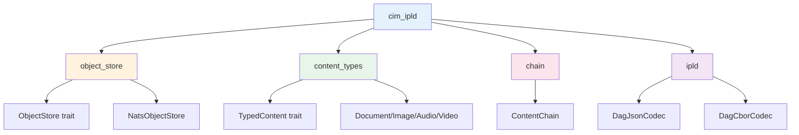
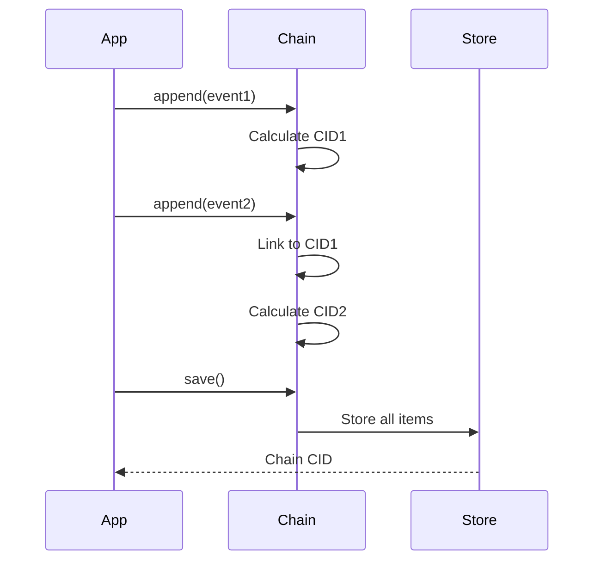

# CIM-IPLD API Reference

## Quick Reference



## Core Traits

### `ObjectStore`

```rust
#[async_trait]
pub trait ObjectStore: Send + Sync {
    async fn put_raw(&self, data: &[u8]) -> Result<Cid>;
    async fn get_raw(&self, cid: &Cid) -> Result<Vec<u8>>;
    async fn put_typed<T: TypedContent>(&self, content: &T) -> Result<Cid>;
    async fn get_typed<T: TypedContent>(&self, cid: &Cid) -> Result<T>;
}
```

### `NatsObjectStore`

```rust
// Create store
let store = NatsObjectStore::new(jetstream).await?;

// Or use builder
let store = NatsObjectStore::builder(jetstream)
    .bucket_prefix("prod")
    .replicas(3)
    .with_cache(1000)
    .build()
    .await?;

// Domain-aware storage
let (cid, domain) = store.put_with_domain(
    &data,
    Some("invoice.pdf"),
    None,
    None,
    None,
).await?;
```

## Content Types

### `TypedContent` Trait

```rust
pub trait TypedContent: Serialize + DeserializeOwned {
    const CODEC: u64;
    const CONTENT_TYPE: ContentType;
}
```

### Built-in Types

```rust
// Documents
TextDocument, MarkdownDocument, PdfDocument, WordDocument

// Images  
JpegImage, PngImage, GifImage, WebPImage

// Audio
Mp3Audio, WavAudio, FlacAudio, AacAudio, OggAudio

// Video
Mp4Video, MovVideo, MkvVideo, AviVideo
```

### Type Detection

```rust
// Auto-detect from bytes
let content_type = ContentType::detect_from_bytes(&data);

// With filename hint
let content_type = ContentType::detect_with_name(&data, "doc.pdf");
```

## Content Chains



### `ContentChain<T>`

```rust
// Create chain
let mut chain = ContentChain::<Event>::new();

// Add items
chain.append(event1)?;
chain.append(event2)?;

// Verify integrity
chain.verify()?;

// Save to storage
let cid = chain.save(&store).await?;

// Load from storage
let chain = ContentChain::<Event>::load(&store, &cid).await?;
```

## IPLD Codecs

```rust
// DAG-JSON (human readable)
let json = DagJsonCodec::encode(&data)?;

// DAG-CBOR (efficient binary)
let cbor = DagCborCodec::encode(&data)?;

// Use convenience methods
let json = data.to_dag_json()?;
let cbor = data.to_dag_cbor()?;
```

## Indexing & Search

```rust
// Create index
let index = ContentIndex::new();

// Index content
index.index_document(cid, &metadata, Some(&text)).await?;

// Search
let results = index.search("important").await?;

// Query by tag
let docs = index.get_by_tag("report").await?;
```

## Encryption

```rust
// Generate key
let key = ContentEncryption::generate_key(EncryptionAlgorithm::ChaCha20Poly1305);

// Create encryption service
let enc = ContentEncryption::new(key, EncryptionAlgorithm::ChaCha20Poly1305)?;

// Encrypt/decrypt
let encrypted = enc.encrypt(&data)?;
let decrypted = enc.decrypt(&encrypted)?;
```

## Transformers

```rust
// Image conversion
let png = ImageTransformer::convert(&jpg_data, "jpeg", "png")?;

// Text extraction
let text = DocumentTransformer::extract_text(&pdf_data)?;
```

## Error Handling

```rust
use cim_ipld::Error;

match store.get_typed::<Doc>(&cid).await {
    Ok(doc) => { /* success */ },
    Err(Error::NotFound) => { /* handle not found */ },
    Err(Error::InvalidContent(msg)) => { /* handle invalid */ },
    Err(e) => { /* handle other */ },
}
```

## Common Patterns

```rust
// Batch operations
let cids = store.put_batch(items).await?;

// With caching
let store = store.with_cache(1000);

// Stream large content
let stream = store.get_stream(&cid).await?;
```

## Feature Flags

```toml
[features]
default = ["nats", "encryption"]
nats = ["async-nats"]           # NATS backend
s3 = ["aws-sdk-s3"]            # S3 backend  
encryption = ["aes-gcm", "chacha20poly1305"]
```


---
Copyright 2025 Cowboy AI, LLC.
