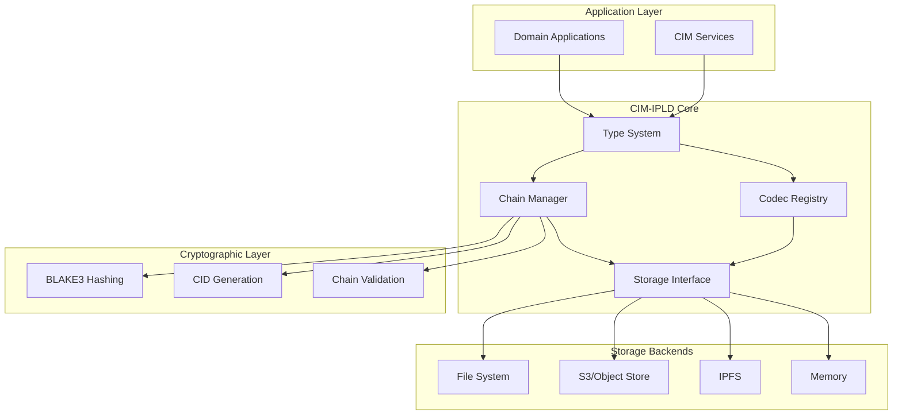
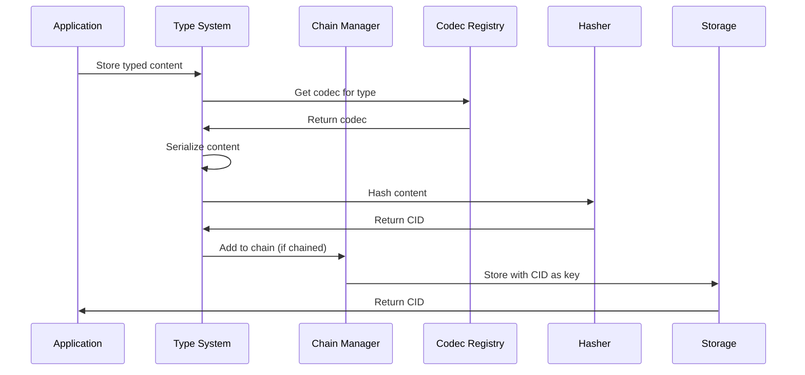
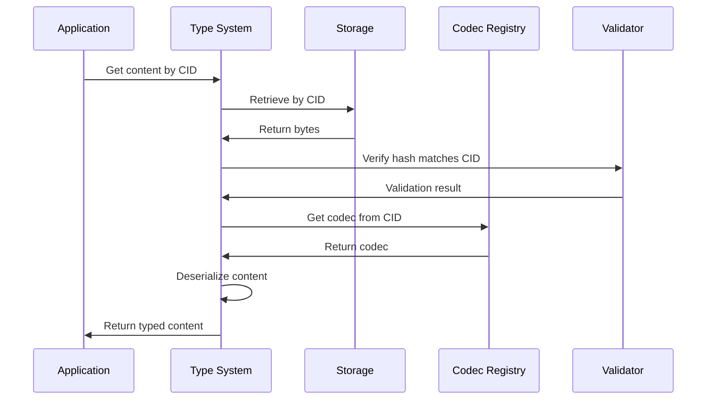
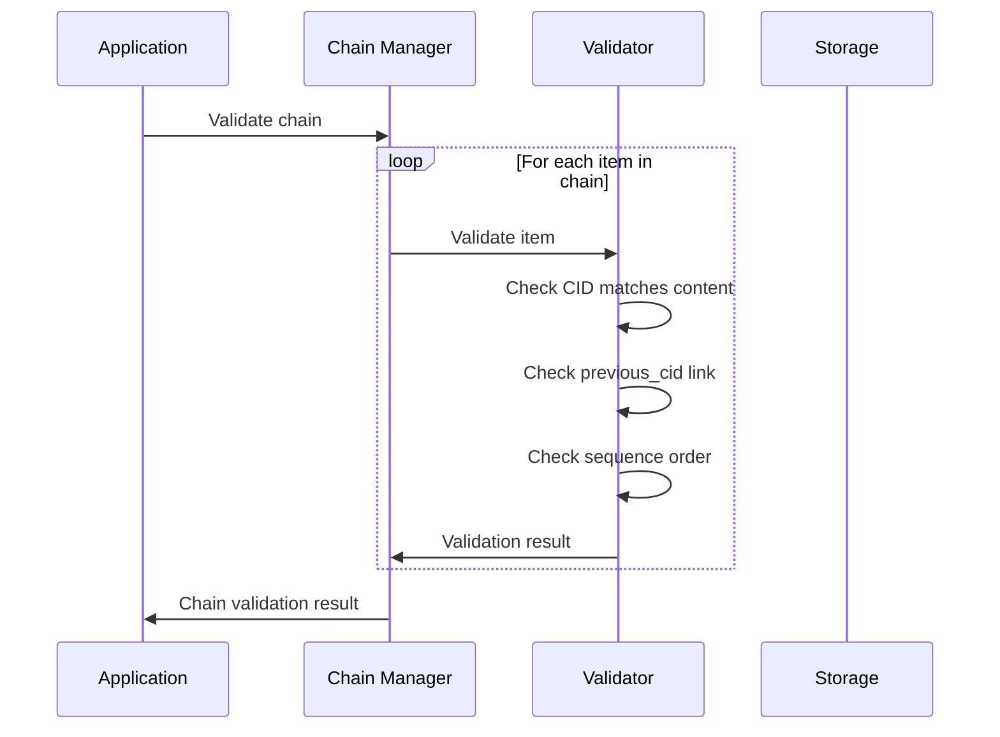

# CIM-IPLD Architecture

## Table of Contents

1. [Overview](#overview)
2. [Design Principles](#design-principles)
3. [System Architecture](#system-architecture)
4. [Core Components](#core-components)
5. [Data Flow](#data-flow)
6. [Integration Points](#integration-points)
7. [Security Model](#security-model)
8. [Performance Considerations](#performance-considerations)
9. [Future Enhancements](#future-enhancements)

## Overview

CIM-IPLD (InterPlanetary Linked Data) provides the content-addressed storage foundation for the Composable Information Machine ecosystem. It enables cryptographically secure, immutable data storage with built-in versioning and chain validation.

### Key Features

- **Content Addressing**: Every piece of data is identified by its cryptographic hash (CID)
- **Immutability**: Once stored, data cannot be modified, only new versions created
- **Chain Linking**: Events and data can be linked in tamper-evident chains
- **Type Safety**: Strongly typed content with compile-time guarantees
- **Extensibility**: Custom codecs and storage backends

## Design Principles

### 1. Content-First Architecture
Data is identified by what it is, not where it is stored. This enables:
- Location-independent references
- Automatic deduplication
- Cryptographic integrity verification

### 2. Type Safety
All content is strongly typed with:
- Compile-time type checking
- Custom codec support
- Schema evolution capabilities

### 3. Chain Integrity
Cryptographic linking ensures:
- Tamper detection
- Ordered event sequences
- Fork detection and resolution

### 4. Pluggable Storage
Abstract storage interface supports:
- Multiple backend implementations
- Transparent migration
- Performance optimization

## System Architecture



## Core Components

### 1. Type System (`traits.rs`)

The type system provides the foundation for content-addressed storage:

```rust
pub trait TypedContent: Serialize + DeserializeOwned {
    /// Unique codec identifier for this content type
    const CODEC: u64;

    /// Content type classification
    const CONTENT_TYPE: ContentType;

    /// Convert to bytes for storage
    fn to_bytes(&self) -> Result<Vec<u8>>;

    /// Create from bytes
    fn from_bytes(bytes: &[u8]) -> Result<Self>;
}
```

**Key Responsibilities:**
- Define content type interfaces
- Ensure type safety
- Enable generic operations

### 2. Chain Manager (`chain/`)

Manages cryptographic chains of content:

```rust
pub struct ContentChain<T: TypedContent> {
    items: Vec<ChainedContent<T>>,
    index: HashMap<Cid, usize>,
}

pub struct ChainedContent<T> {
    pub cid: Cid,
    pub previous_cid: Option<Cid>,
    pub sequence: u64,
    pub timestamp: SystemTime,
    pub content: T,
}
```

**Key Features:**
- Append-only chains
- Fork detection
- Chain validation
- Efficient traversal

### 3. Codec Registry (`codec/`)

Manages content encoding/decoding:

```rust
pub struct CodecRegistry {
    codecs: HashMap<u64, Arc<dyn CimCodec>>,
}

pub trait CimCodec: Send + Sync {
    fn code(&self) -> u64;
    fn name(&self) -> &str;
    fn encode(&self, data: &[u8]) -> Result<Vec<u8>>;
    fn decode(&self, data: &[u8]) -> Result<Vec<u8>>;
}
```

**Codec Ranges:**
- `0x300000-0x30FFFF`: Core CIM types
- `0x310000-0x31FFFF`: Document types
- `0x320000-0x32FFFF`: Media types
- `0x330000-0x3FFFFF`: Custom types

### 4. Storage Interface (`object_store/`)

Abstract storage layer:

```rust
#[async_trait]
pub trait ObjectStore: Send + Sync {
    async fn put(&self, key: &str, data: Vec<u8>) -> Result<()>;
    async fn get(&self, key: &str) -> Result<Vec<u8>>;
    async fn delete(&self, key: &str) -> Result<()>;
    async fn exists(&self, key: &str) -> Result<bool>;
    async fn list(&self, prefix: &str) -> Result<Vec<String>>;
}
```

**Implementations:**
- `FileStore`: Local filesystem
- `S3Store`: S3-compatible object storage
- `MemoryStore`: In-memory for testing
- `IpfsStore`: IPFS integration (planned)

## Data Flow

### 1. Content Storage Flow



### 2. Content Retrieval Flow



### 3. Chain Validation Flow



## Integration Points

### 1. CIM Domain Integration

```rust
// Domain event storage
use cim_ipld::{TypedContent, ContentChain};

#[derive(Serialize, Deserialize)]
struct DomainEvent {
    aggregate_id: String,
    event_type: String,
    payload: serde_json::Value,
}

impl TypedContent for DomainEvent {
    const CODEC: u64 = 0x300000;
    const CONTENT_TYPE: ContentType = ContentType::Event;
}

// Create event chain
let mut event_chain = ContentChain::<DomainEvent>::new();
event_chain.append(event)?;
```

### 2. NATS Integration

```rust
// Publish CID references over NATS
let cid = storage.put(content).await?;
nats_client.publish("events.stored", cid.to_string()).await?;

// Subscribe and retrieve
let message = nats_client.subscribe("events.stored").await?;
let cid = Cid::from_str(&message.data)?;
let content = storage.get(&cid).await?;
```

### 3. GraphQL API

```graphql
type Query {
  # Get content by CID
  content(cid: String!): Content

  # Get chain from starting CID
  chain(startCid: String!, limit: Int): [ChainedContent!]!

  # Validate chain integrity
  validateChain(headCid: String!): ValidationResult!
}

type Mutation {
  # Store new content
  storeContent(input: ContentInput!): String!

  # Append to chain
  appendToChain(chainId: String!, content: ContentInput!): String!
}
```

## Security Model

### 1. Content Integrity

- **Hash Verification**: Every retrieval verifies content hash
- **Immutability**: Content cannot be modified after storage
- **Chain Validation**: Detect tampering in event chains

### 2. Access Control

```rust
pub trait AccessControl {
    async fn can_read(&self, cid: &Cid, principal: &Principal) -> Result<bool>;
    async fn can_write(&self, content_type: &ContentType, principal: &Principal) -> Result<bool>;
}
```

### 3. Encryption Support

```rust
pub struct EncryptedContent<T> {
    pub cid: Cid,
    pub encrypted_data: Vec<u8>,
    pub key_id: String,
    pub algorithm: EncryptionAlgorithm,
}
```

## Performance Considerations

### 1. Hashing Performance

- **BLAKE3**: Fast, parallel hashing
- **Benchmarks**: ~3 GB/s on modern hardware
- **Optimization**: Streaming for large files

### 2. Storage Optimization

```rust
pub struct StorageMetrics {
    pub total_objects: u64,
    pub total_bytes: u64,
    pub dedup_ratio: f64,
    pub avg_object_size: u64,
}
```

### 3. Caching Strategy

```rust
pub struct CacheConfig {
    pub max_size: usize,
    pub ttl: Duration,
    pub eviction_policy: EvictionPolicy,
}

pub enum EvictionPolicy {
    LRU,
    LFU,
    FIFO,
}
```

### 4. Batch Operations

```rust
pub trait BatchOperations {
    async fn put_batch(&self, items: Vec<(T, Metadata)>) -> Result<Vec<Cid>>;
    async fn get_batch(&self, cids: &[Cid]) -> Result<Vec<Option<T>>>;
}
```

## Future Enhancements

### 1. Advanced Features

- **Merkle DAGs**: Support for complex data structures
- **IPLD Schemas**: Formal schema definitions
- **GraphSync**: Efficient graph synchronization
- **Filecoin Integration**: Decentralized storage

### 2. Performance Improvements

- **Parallel Chain Validation**: Validate multiple chains concurrently
- **Incremental Hashing**: Update hashes for append operations
- **Zero-Copy Deserialization**: Reduce memory allocations

### 3. Developer Experience

- **Code Generation**: Generate TypedContent implementations
- **Migration Tools**: Assist with schema evolution
- **Debugging Tools**: Chain visualization and analysis
- **Performance Profiler**: Identify bottlenecks

### 4. Ecosystem Integration

- **IPFS Compatibility**: Full IPLD spec compliance
- **Substrate Integration**: Blockchain storage backend
- **OrbitDB Support**: Distributed databases
- **Ceramic Network**: Decentralized data streams

## Appendix: Design Decisions

### Why BLAKE3?

1. **Performance**: 3x faster than SHA-256
2. **Security**: 256-bit security level
3. **Parallelism**: Scales with CPU cores
4. **Simplicity**: Single algorithm for all sizes

### Why Custom Codec Registry?

1. **Type Safety**: Compile-time guarantees
2. **Extensibility**: Domain-specific optimizations
3. **Versioning**: Clear upgrade paths
4. **Performance**: Avoid runtime type detection

### Why Abstract Storage?

1. **Flexibility**: Deploy anywhere
2. **Testing**: Easy mocking
3. **Migration**: Change backends seamlessly
4. **Optimization**: Backend-specific features
