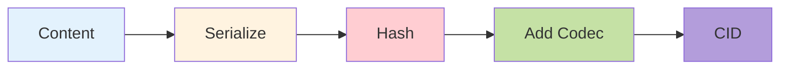
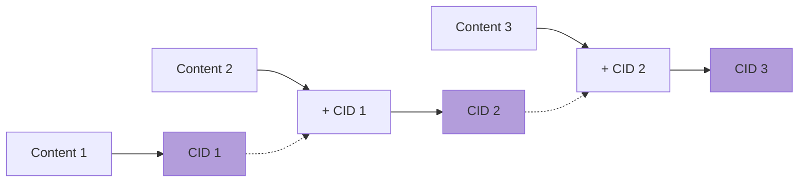

# CID Calculation in CIM-IPLD

## Overview

Content Identifiers (CIDs) are self-describing content addresses used in CIM-IPLD to uniquely identify content based on its cryptographic hash. This document explains how CIDs are calculated and used throughout the system.

## What is a CID?

A CID is a self-describing content address that contains:
- **Version**: CID format version (v0 or v1)
- **Codec**: How the content is encoded
- **Multihash**: The cryptographic hash of the content

### CID Structure

```
CIDv1 = <multibase>(<version><codec><multihash>)

Example: bafyreigdyrzt5sfp7udm7hu76uh7y26nf3efuylqabf3oclgtqy55fbzdi
         ↑       ↑                                                ↑
    base32    version+codec+hash                              hash
```

## CID Calculation Process



### Quick Example

```rust
// 1. Define content
#[derive(Serialize, Deserialize)]
struct MyContent { data: String }

// 2. Calculate CID
let cid = CidBuilder::new()
    .with_codec(0x71)  // dag-cbor
    .build(&serde_cbor::to_vec(&content)?)?;
```

## CIM-IPLD CID Builder

### Basic Usage

```rust
use cim_ipld::cid::CidBuilder;

let cid = CidBuilder::new()
    .with_codec(0x71) // dag-cbor
    .with_hash(0x12)  // sha2-256
    .build(&content_bytes)?;
```

### Advanced Options

```rust
let cid = CidBuilder::new()
    .with_codec(0x0129)      // dag-json
    .with_hash(0x16)         // sha3-256
    .with_hash_size(32)      // 256 bits
    .with_version(1)         // CID v1
    .build(&content_bytes)?;
```

## Codec Selection

### Standard IPLD Codecs

| Codec | Code | Description | Use Case |
|-------|------|-------------|----------|
| raw | 0x55 | Raw bytes | Binary data, files |
| dag-cbor | 0x71 | CBOR with IPLD conventions | Structured data |
| dag-json | 0x0129 | JSON with IPLD conventions | Human-readable data |
| dag-pb | 0x70 | Protocol Buffers | Legacy IPFS compatibility |

### CIM-IPLD Custom Codecs

| Codec | Code | Description | Use Case |
|-------|------|-------------|----------|
| cim-event | 0x300000 | Event codec | Event sourcing |
| cim-chain | 0x300001 | Chain codec | Linked content |
| cim-encrypted | 0x300002 | Encrypted codec | Secure content |

## Hash Function Selection

### Supported Hash Functions

| Hash | Code | Size | Performance | Security |
|------|------|------|-------------|----------|
| sha2-256 | 0x12 | 256 bits | Good | High |
| sha3-256 | 0x16 | 256 bits | Moderate | Very High |
| sha2-512 | 0x13 | 512 bits | Good | Very High |
| blake2b-256 | 0xb220 | 256 bits | Excellent | High |

### Choosing a Hash Function

```rust
// Default: SHA2-256 (good balance)
let cid = store.put_typed(&content).await?;

// High security: SHA3-256
let cid = CidBuilder::new()
    .with_hash(0x16)
    .build(&content_bytes)?;

// Performance critical: Blake2b
let cid = CidBuilder::new()
    .with_hash(0xb220)
    .build(&content_bytes)?;
```

## Deterministic CID Generation

CIDs are deterministic - the same content always produces the same CID:

```rust
// These will produce identical CIDs
let content1 = MyContent { data: "hello".to_string(), timestamp: 12345 };
let content2 = MyContent { data: "hello".to_string(), timestamp: 12345 };

let cid1 = store.put_typed(&content1).await?;
let cid2 = store.put_typed(&content2).await?;

assert_eq!(cid1, cid2); // Same CID!
```

### Ensuring Determinism

1. **Consistent Serialization**:
   ```rust
   // Use canonical serialization
   #[derive(Serialize)]
   struct Data {
       #[serde(serialize_with = "ordered_map")]
       map: HashMap<String, Value>,
   }
   ```

2. **Avoid Non-Deterministic Fields**:
   ```rust
   // Bad: Random values
   struct BadContent {
       id: Uuid, // Different each time!
       data: String,
   }
   
   // Good: Deterministic values
   struct GoodContent {
       data: String,
       version: u32,
   }
   ```

3. **Timestamp Handling**:
   ```rust
   // Use fixed precision
   let timestamp = SystemTime::now()
       .duration_since(UNIX_EPOCH)?
       .as_secs(); // Not as_millis()!
   ```

## Chain CID Calculation



### Chain Structure

```rust
struct ChainItem<T> {
    previous_cid: Option<Cid>,  // Links to previous
    content: T,                 // Actual data
    timestamp: u64,             // When created
}
```

This creates an immutable chain where changing any item invalidates all subsequent CIDs.

## CID Verification

### Verifying Content Matches CID

```rust
pub fn verify_cid(cid: &Cid, content: &[u8]) -> Result<bool> {
    // Extract codec and hash from CID
    let codec = cid.codec();
    let hash_code = cid.hash().code();
    
    // Recalculate CID
    let calculated = CidBuilder::new()
        .with_codec(codec)
        .with_hash(hash_code)
        .build(content)?;
    
    Ok(calculated == *cid)
}
```

### Automatic Verification

CIM-IPLD automatically verifies CIDs on retrieval:

```rust
// This internally verifies the CID matches the content
let content: MyContent = store.get_typed(&cid).await?;
// If verification fails, an error is returned
```

## Performance Considerations

### CID Caching

```rust
// CIDs are cached with content
pub struct CachedContent<T> {
    content: T,
    cid: OnceCell<Cid>,
}

impl<T: TypedContent> CachedContent<T> {
    pub fn cid(&self) -> Result<&Cid> {
        self.cid.get_or_try_init(|| {
            let bytes = self.content.to_bytes()?;
            CidBuilder::new().build(&bytes)
        })
    }
}
```

### Batch CID Calculation

```rust
use futures::stream::{self, StreamExt};

// Parallel CID calculation
let cids: Vec<Cid> = stream::iter(contents)
    .map(|content| async move {
        let bytes = content.to_bytes()?;
        CidBuilder::new().build(&bytes)
    })
    .buffer_unordered(10)
    .collect()
    .await;
```

## CID Formats and Encoding

### String Representations

```rust
// Base32 (default for CIDv1)
let base32 = cid.to_string();
// bafyreigdyrzt5sfp7udm7hu76uh7y26nf3efuylqabf3oclgtqy55fbzdi

// Base58 (Bitcoin alphabet)
let base58 = multibase::encode(multibase::Base::Base58Btc, cid.to_bytes());
// zQmcTJr3WgHbqppNfUUAS3unXqaTeUvfkPzQ8bPJLGjZNR7

// Base64
let base64 = multibase::encode(multibase::Base::Base64, cid.to_bytes());
// mAXASIKlIb3vc+HD9mhPp7K+slRGNBbNLD5wd3S5VmVcHWxeX
```

### Binary Format

```rust
// Get raw bytes
let bytes = cid.to_bytes();

// Parse from bytes
let cid = Cid::try_from(bytes)?;
```

## Common Patterns

### Content Deduplication

```rust
// Same content = same CID = stored once
let doc1 = TextDocument { content: "Hello".into(), metadata: Default::default() };
let doc2 = TextDocument { content: "Hello".into(), metadata: Default::default() };

let cid1 = store.put_typed(&doc1).await?;
let cid2 = store.put_typed(&doc2).await?;

assert_eq!(cid1, cid2); // Deduplicated!
```

### Content Versioning

```rust
#[derive(Serialize, Deserialize)]
struct VersionedContent<T> {
    version: u32,
    previous: Option<Cid>,
    content: T,
}

// Each version has unique CID
let v1_cid = store.put_typed(&version1).await?;
let v2_cid = store.put_typed(&version2).await?;
```

### Content Linking

```rust
#[derive(Serialize, Deserialize)]
struct LinkedDocument {
    title: String,
    content: String,
    references: Vec<Cid>, // Links to other documents
}
```

## Security Considerations

### CID Collision Resistance

- SHA2-256: 2^128 security against collisions
- SHA3-256: Enhanced security with different algorithm
- Multiple hash support prevents single algorithm compromise

### Preimage Resistance

CIDs cannot be reversed to obtain content:
- One-way hash functions
- No content leakage from CID
- Safe to share CIDs publicly

### Integrity Guarantees

```rust
// Any modification changes the CID
let mut content = original_content.clone();
content.data.push_str(" modified");

let original_cid = calculate_cid(&original_content)?;
let modified_cid = calculate_cid(&content)?;

assert_ne!(original_cid, modified_cid);
```

## Troubleshooting

### CID Mismatch Errors

```rust
// Common causes:
// 1. Content corruption
// 2. Serialization differences
// 3. Codec mismatch

match store.get_typed::<MyContent>(&cid).await {
    Err(Error::CidMismatch { expected, actual }) => {
        println!("Expected: {}, Actual: {}", expected, actual);
        // Content doesn't match its CID!
    }
    _ => {}
}
```

### Debugging CID Calculation

```rust
// Step-by-step CID calculation
let content = MyContent { /* ... */ };

// 1. Serialize
let bytes = serde_cbor::to_vec(&content)?;
println!("Serialized size: {} bytes", bytes.len());

// 2. Hash
let hash = Code::Sha2_256.digest(&bytes);
println!("Hash: {:?}", hash);

// 3. Create CID
let cid = Cid::new_v1(0x71, hash);
println!("CID: {}", cid);
```

## Best Practices

1. **Use Standard Codecs**: Prefer dag-cbor or dag-json for interoperability
2. **Consistent Serialization**: Ensure deterministic serialization
3. **Document Custom Codecs**: If using custom codecs, document thoroughly
4. **Verify on Retrieval**: Always verify CIDs match content
5. **Cache CIDs**: Avoid recalculating CIDs for known content


---
Copyright 2025 Cowboy AI, LLC.
