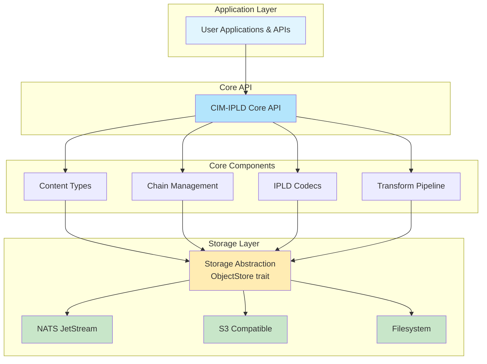
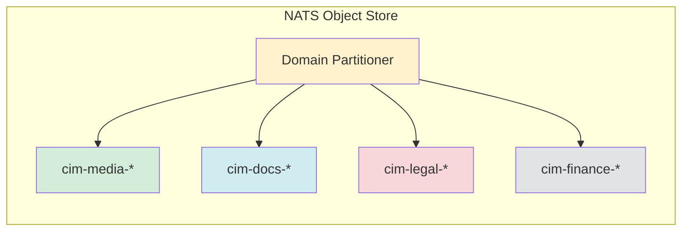
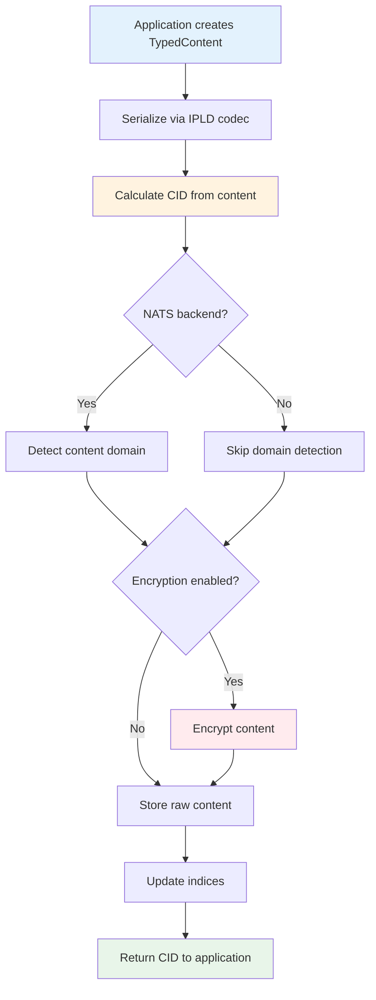
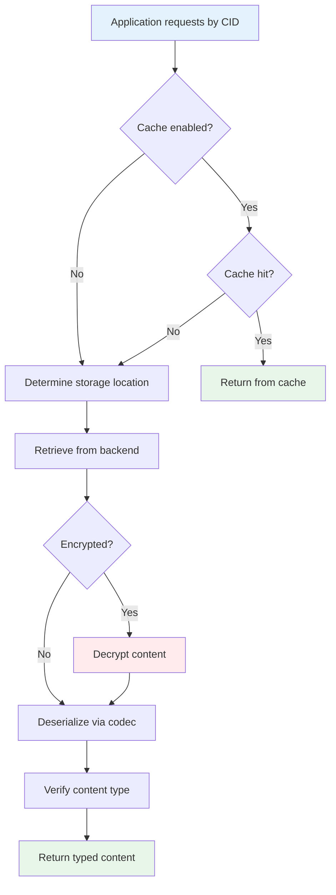
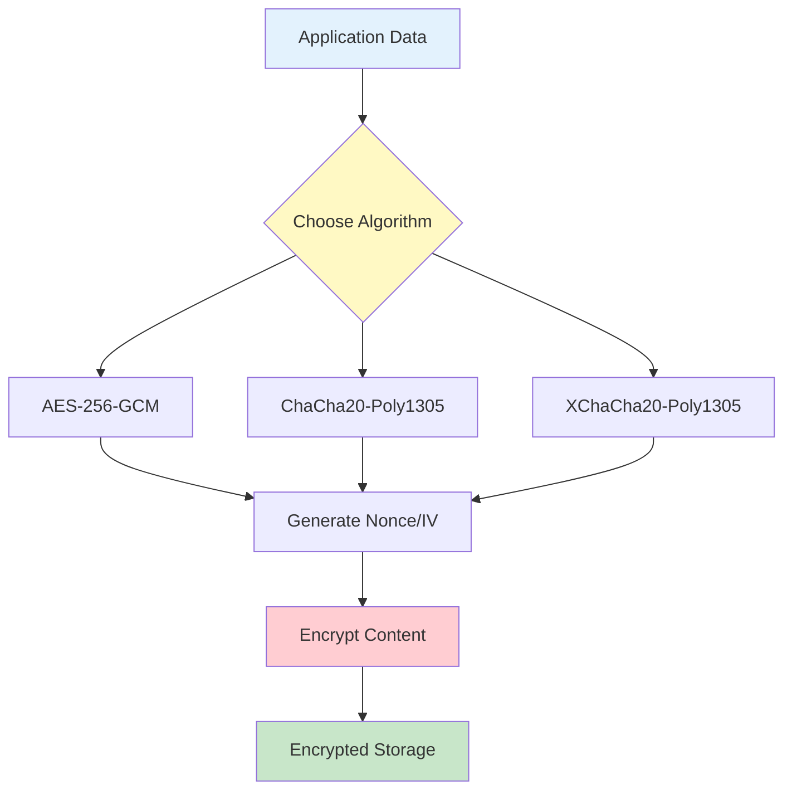
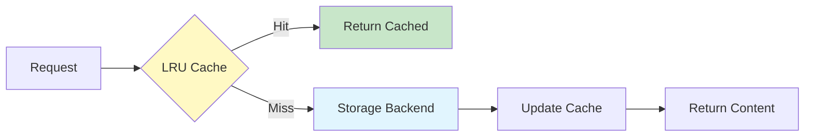
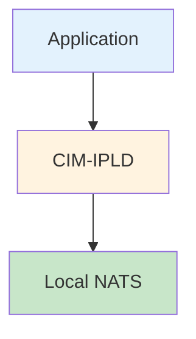
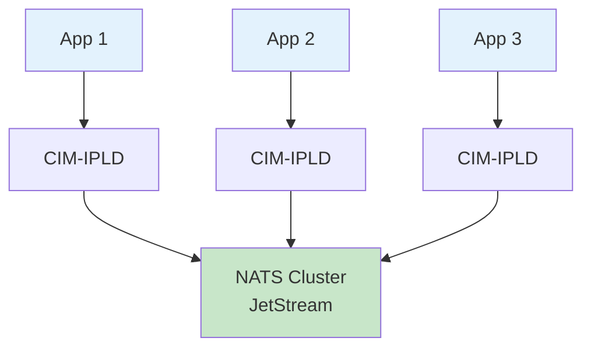
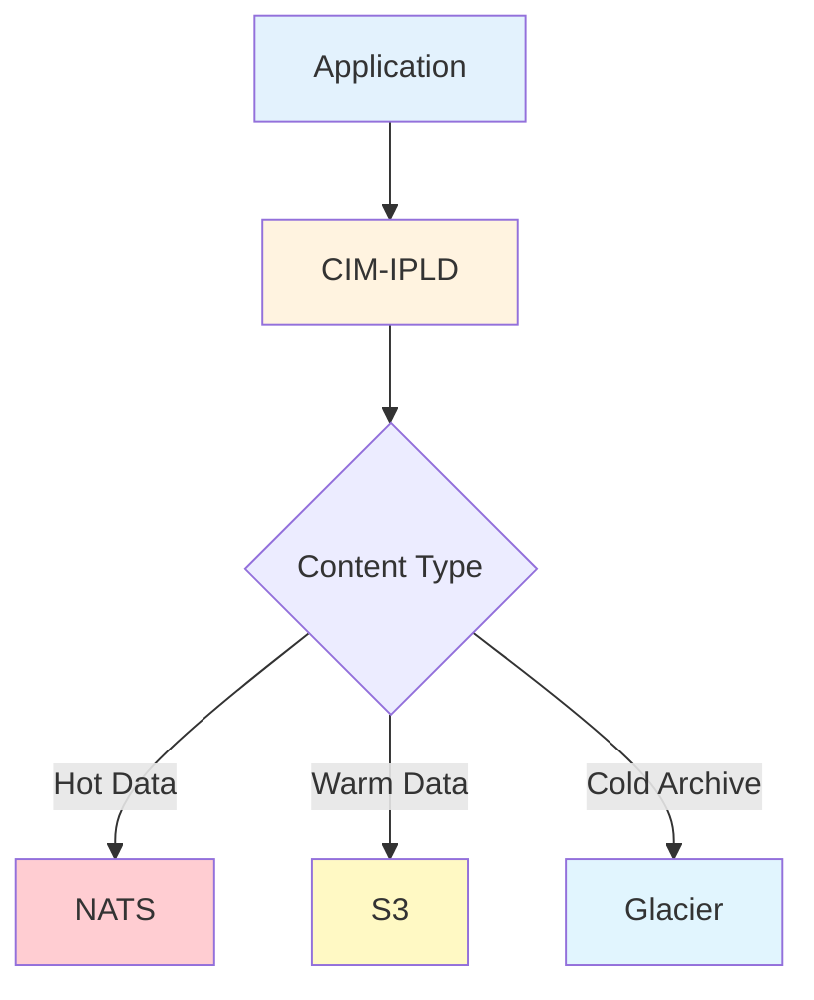

# CIM-IPLD System Architecture

## Overview

CIM-IPLD (Composable Information Machine - InterPlanetary Linked Data) is a content-addressed storage system designed for building distributed, immutable data structures with cryptographic integrity guarantees.

## Architecture Layers



## Core Components

### 1. Content Types Layer

**Purpose**: Define and manage different content formats with type safety.

**Key Components**:
- `TypedContent` trait: Interface for all content types
- `ContentType` enum: Identifies content format
- Type-specific implementations (documents, images, audio, video)
- Metadata structures for each content category

**Design Principles**:
- Strong typing for compile-time safety
- Extensible for custom content types
- Built-in format verification
- Rich metadata support

### 2. Chain Management

**Purpose**: Provide cryptographically linked sequences of content.

**Key Components**:
- `ContentChain<T>`: Generic chain implementation
- `ChainItem<T>`: Individual chain elements
- Chain validation and verification logic
- Event sourcing support

**Design Principles**:
- Immutable append-only structure
- Cryptographic integrity through hash linking
- Support for any `TypedContent` type
- Efficient traversal and validation

### 3. IPLD Codecs

**Purpose**: Serialize and deserialize content using IPLD standards.

**Key Components**:
- `IpldCodec` trait: Common codec interface
- DAG-JSON codec: Human-readable JSON with CID links
- DAG-CBOR codec: Efficient binary format
- Raw codec: Direct byte storage
- Custom CIM codecs: Domain-specific formats

**Design Principles**:
- Standards compliance (IPLD specifications)
- Efficient serialization
- Support for linked data structures
- Extensible codec system

### 4. Storage Abstraction

**Purpose**: Provide a unified interface for different storage backends.

**Key Components**:
- `ObjectStore` trait: Common storage operations
- CID-based addressing
- Batch operation support
- Cache integration

**Design Principles**:
- Backend agnostic
- Async/await for non-blocking I/O
- Consistent error handling
- Performance optimization hooks

### 5. Storage Backends

#### NATS JetStream



**Features**:
- Distributed storage with replication
- Domain-based content partitioning
- LRU cache integration
- Streaming support
- At-rest encryption

#### S3-Compatible

**Features**:
- Works with AWS S3, MinIO, etc.
- Bucket and prefix organization
- Multipart upload for large objects
- Server-side encryption support

#### Filesystem

**Features**:
- Local development and testing
- Directory-based organization
- Direct file access
- OS-level permissions

## Data Flow

### Write Path



### Read Path



## Security Architecture

### Content Integrity

- **CID Verification**: Every read verifies content matches its CID
- **Chain Validation**: Cryptographic linking prevents tampering
- **Type Safety**: Runtime verification of content format

### Encryption



### Access Control

- Backend-specific mechanisms (NATS permissions, S3 IAM)
- Application-level access control
- Domain-based isolation

## Performance Optimization

### Caching Strategy



### Batch Operations

- Parallel processing for multiple operations
- Reduced network round trips
- Transaction-like semantics where supported

### Streaming

- Large content streaming to avoid memory exhaustion
- Chunked uploads/downloads
- Progressive processing

## Extensibility Points

### Custom Content Types

```rust
// Define custom content type with minimal boilerplate
content_type!(MyContent, 0x400000, ContentType::Custom(0x400000));
```

### Custom Codecs

```rust
// Register new codec
registry.register(Arc::new(MyCodec { code: 0x400001 }));
```

### Storage Backend Plugins

```rust
// Implement ObjectStore trait
#[async_trait]
impl ObjectStore for MyStore {
    async fn put_raw(&self, data: &[u8]) -> Result<Cid> { /* ... */ }
    async fn get_raw(&self, cid: &Cid) -> Result<Vec<u8>> { /* ... */ }
}
```

## Deployment Patterns

### Standalone Service



### Distributed System



### Hybrid Storage



## Monitoring and Observability

### Metrics

- Storage operations (puts/gets per second)
- Cache hit rates
- Chain validation times
- Content type distribution
- Error rates by operation

### Logging

- Structured logging with `tracing`
- Configurable log levels
- Operation correlation IDs
- Performance timing

### Health Checks

- Backend connectivity
- Storage capacity
- Index health
- Chain integrity

## Future Architecture Considerations

### Planned Enhancements

1. **Sharding**: Content distribution across multiple backends
2. **Replication**: Active-active replication strategies
3. **Federation**: Cross-system content sharing
4. **GraphQL API**: Query interface for complex data relationships
5. **WASM Plugins**: Runtime extensibility

### Scalability Path

1. **Horizontal Scaling**: Add more storage nodes
2. **Vertical Scaling**: Increase node resources
3. **Geographic Distribution**: Regional content placement
4. **Edge Caching**: CDN integration

## Design Decisions

### Why IPLD?

- Standard data model for distributed systems
- Built-in content addressing
- Supports multiple serialization formats
- Enables data structure linking

### Why NATS JetStream?

- High-performance messaging backbone
- Built-in persistence with KV store
- Distributed by design
- Stream processing capabilities

### Why Domain Partitioning?

- Logical content organization
- Compliance and regulatory support
- Performance optimization
- Simplified access control

### Why Type Safety?

- Compile-time error prevention
- Self-documenting code
- Better IDE support
- Reduced runtime errors


---
Copyright 2025 Cowboy AI, LLC.
