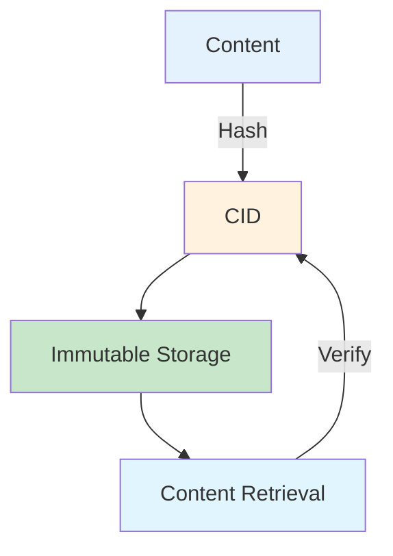
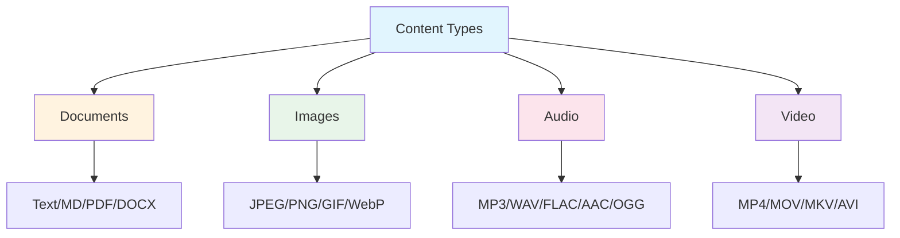

# CIM-IPLD Developer Guide

## Table of Contents

1. [Getting Started](#getting-started)
2. [Core Concepts](#core-concepts)
3. [Basic Usage](#basic-usage)
4. [Content Types](#content-types)
5. [IPLD Integration](#ipld-integration)
6. [Content Chains](#content-chains)
7. [Storage Backends](#storage-backends)
8. [Advanced Features](#advanced-features)
9. [Best Practices](#best-practices)
10. [Troubleshooting](#troubleshooting)

## Getting Started

### Installation

Add CIM-IPLD to your `Cargo.toml`:

```toml
[dependencies]
cim-ipld = "0.5.0"
```

### Prerequisites

- Rust 1.70 or later
- NATS Server with JetStream enabled (for persistence)
- Optional: OpenSSL development libraries

### Quick Start

```rust
use cim_ipld::{ContentChain, TextDocument, DocumentMetadata};

#[tokio::main]
async fn main() -> Result<(), Box<dyn std::error::Error>> {
    // Create a content chain
    let mut chain = ContentChain::new();
    
    // Add documents to the chain
    let doc = TextDocument {
        content: "Hello, IPLD!".to_string(),
        metadata: DocumentMetadata {
            title: Some("My Document".to_string()),
            ..Default::default()
        },
    };
    
    let cid = chain.add_content(&doc).await?;
    println!("Content CID: {}", cid);
    
    // Verify chain integrity
    assert!(chain.verify().is_ok());
    
    Ok(())
}
```

## Core Concepts



**Key Features:**
- **Content Addressing**: Data identified by hash (CID), not location
- **IPLD**: Unified data model with codec flexibility
- **Content Chains**: Cryptographically linked sequences

## Basic Usage

### Storing Content

```rust
// Setup
let store = NatsObjectStore::new(jetstream).await?;

// Store document
let doc = TextDocument {
    content: "Hello IPLD".to_string(),
    metadata: Default::default(),
};
let cid = store.put_typed(&doc).await?;
```

### Retrieving Content

```rust
// Type-safe retrieval
let doc: TextDocument = store.get_typed(&cid).await?;

// Auto-detect type
let (content_type, data) = store.get_with_type(&cid).await?;
```

### Working with Different Content Types

```rust
// Documents
let pdf = PdfDocument { data: pdf_bytes, metadata: Default::default() };

// Images  
let jpg = JpegImage { data: jpg_bytes, metadata: Default::default() };

// Audio
let mp3 = Mp3Audio { data: mp3_bytes, metadata: Default::default() };

// Store any type
let cid = store.put_typed(&pdf).await?;
```

## Content Types



### Custom Content Types

```rust
#[derive(Serialize, Deserialize)]
struct Invoice { number: String, amount: f64 }

// Use the macro for less boilerplate
content_type!(Invoice, 0x400000, ContentType::Custom(0x400000));
```

### Content Type Detection

```rust
// Automatic detection from bytes
let content_type = ContentType::detect_from_bytes(&file_bytes);

// Detection with filename hint
let content_type = ContentType::detect_with_name(&file_bytes, "document.pdf");

// Verify content matches expected type
if PdfDocument::verify(&file_bytes) {
    println!("Valid PDF document");
}
```

## IPLD Integration

### Working with DAG-JSON

```rust
use cim_ipld::ipld::{DagJsonCodec, IpldCodec};

let data = json!({
    "name": "Example",
    "link": { "/": "bafyreigdyrzt5sfp7udm7hu76uh7y26nf3efuylqabf3oclgtqy55fbzdi" }
});

let bytes = DagJsonCodec::encode(&data)?;
let decoded = DagJsonCodec::decode(&bytes)?;
```

### Working with DAG-CBOR

```rust
use cim_ipld::ipld::{DagCborCodec, IpldCodec};

let data = ipld!({
    "values": [1, 2, 3],
    "nested": {
        "field": "value"
    }
});

let bytes = DagCborCodec::encode(&data)?;
let decoded = DagCborCodec::decode(&bytes)?;
```

### CID Calculation

```rust
use cim_ipld::cid::CidBuilder;

// Calculate CID for content
let cid = CidBuilder::new()
    .with_codec(0x71) // dag-cbor
    .with_hash(0x12) // sha2-256
    .build(&content_bytes)?;

println!("CID: {}", cid);
```

## Content Chains


### Creating Event Chains

```rust
// Define events
#[derive(Serialize, Deserialize)]
enum Event {
    Created { id: String },
    Updated { id: String },
}

// Create chain
let mut chain = ContentChain::<Event>::new();
chain.append(Event::Created { id: "123".to_string() })?;
chain.append(Event::Updated { id: "123".to_string() })?;

// Save and get CID
let cid = chain.save(&store).await?;
```

### Loading and Validating Chains

```rust
// Load chain from storage
let loaded_chain = ContentChain::<Event>::load(&store, &chain_cid).await?;

// Validate entire chain
loaded_chain.validate()?;

// Iterate through chain
for (index, item) in loaded_chain.iter().enumerate() {
    println!("Event {}: {:?}", index, item.content);
    println!("  CID: {}", item.cid);
    if let Some(prev) = &item.previous_cid {
        println!("  Previous: {}", prev);
    }
}
```

### Chain Traversal

```rust
// Get chain head
let head = chain.head()?;
println!("Latest event: {:?}", head.content);

// Get chain length
println!("Chain length: {}", chain.len());

// Find specific event
let found = chain.iter()
    .find(|item| matches!(&item.content, Event::Updated { id, .. } if id == "123"))
    .map(|item| &item.cid);
```

## Storage Backends

### NATS JetStream Backend

```rust
use cim_ipld::object_store::NatsObjectStore;

// Basic setup
let client = async_nats::connect("nats://localhost:4222").await?;
let jetstream = async_nats::jetstream::new(client);
let store = NatsObjectStore::new(jetstream).await?;

// With custom configuration
let store = NatsObjectStore::builder(jetstream)
    .bucket_prefix("my-app")
    .replicas(3)
    .build()
    .await?;
```

### S3-Compatible Backend

```rust
use cim_ipld::object_store::S3Store;

let store = S3Store::builder()
    .endpoint("https://s3.amazonaws.com")
    .bucket("my-bucket")
    .prefix("cim-ipld/")
    .credentials(key_id, secret_key)
    .build()
    .await?;
```

### Filesystem Backend

```rust
use cim_ipld::object_store::FileStore;

let store = FileStore::new("/var/lib/cim-ipld")?;
```

### Backend Features

#### Caching

```rust
// Enable LRU cache
let cached_store = store.with_cache(1000); // 1000 item cache

// Preload frequently accessed content
cached_store.preload(&[cid1, cid2, cid3]).await?;
```

#### Replication

```rust
// Configure replication
let store = NatsObjectStore::builder(jetstream)
    .replicas(3)
    .build()
    .await?;
```

## Advanced Features

### Content Transformation

```rust
use cim_ipld::content_types::transformers::*;

// Convert between image formats
let png_data = ImageTransformer::convert(&jpeg_data, "jpeg", "png")?;

// Extract text from PDF
let text = DocumentTransformer::extract_text(&pdf_data)?;

// Compress content
let compressed = CompressionTransformer::compress(&data, "gzip")?;
```

### Content Indexing

```rust
use cim_ipld::content_types::indexing::ContentIndex;

// Create index
let index = ContentIndex::new();

// Index document
let metadata = DocumentMetadata {
    title: Some("Important Document".to_string()),
    tags: Some(vec!["report".to_string(), "2024".to_string()]),
    ..Default::default()
};

index.index_document(cid, &metadata, Some(&content_text)).await?;

// Search
let results = index.search("important").await?;
for result in results {
    println!("Found: {} (score: {})", result.cid, result.score);
}

// Query by tag
let tagged = index.get_by_tag("report").await?;
```

### Encryption

```rust
use cim_ipld::content_types::encryption::{ContentEncryption, EncryptionAlgorithm};

// Generate encryption key
let key = ContentEncryption::generate_key(EncryptionAlgorithm::ChaCha20Poly1305);

// Create encryption service
let encryption = ContentEncryption::new(key, EncryptionAlgorithm::ChaCha20Poly1305)?;

// Encrypt content
let encrypted = encryption.encrypt(&sensitive_data)?;

// Store encrypted
let cid = store.put_raw(&encrypted).await?;

// Retrieve and decrypt
let encrypted_data = store.get_raw(&cid).await?;
let decrypted = encryption.decrypt(&encrypted_data)?;
```

### Domain Partitioning

```rust
// Store with automatic domain detection
let (cid, domain) = store.put_with_domain(
    &content,
    Some("invoice.pdf"),
    Some("application/pdf"),
    Some("Invoice #12345"),
    None,
).await?;

println!("Stored in domain: {:?}", domain); // ContentDomain::Invoices

// Retrieve from specific domain
let invoices = store.list_domain(ContentDomain::Invoices).await?;
```

### Batch Operations

```rust
// Batch store
let items = vec![
    (&doc1, ContentType::TextDocument),
    (&doc2, ContentType::TextDocument),
    (&doc3, ContentType::PdfDocument),
];

let cids = store.put_batch(items).await?;

// Batch retrieve
let contents = store.get_batch(&cids).await?;
```

## Best Practices

### Error Handling

```rust
use cim_ipld::Error;

match store.get_typed::<TextDocument>(&cid).await {
    Ok(doc) => println!("Retrieved: {}", doc.content),
    Err(Error::NotFound) => println!("Content not found"),
    Err(Error::InvalidContent(msg)) => println!("Invalid content: {}", msg),
    Err(e) => println!("Error: {}", e),
}
```

### Resource Management

```rust
// Use connection pooling
let client = async_nats::ConnectOptions::new()
    .max_reconnects(5)
    .connection_timeout(Duration::from_secs(10))
    .connect("nats://localhost:4222")
    .await?;

// Clean up resources
drop(store); // Closes connections
```

### Performance Optimization

```rust
// Enable caching for read-heavy workloads
let store = store.with_cache(10000);

// Use batch operations
let cids = store.put_batch(documents).await?;

// Stream large content
let stream = store.get_stream(&cid).await?;
```

### Security Considerations

```rust
// Validate content before storing
if !PdfDocument::verify(&untrusted_data) {
    return Err("Invalid PDF content".into());
}

// Use encryption for sensitive data
let encrypted = encryption.encrypt(&sensitive_data)?;

// Verify chain integrity
chain.validate()?;
```

## Troubleshooting

### Common Issues

#### NATS Connection Failed

```rust
// Check NATS server is running with JetStream
// Enable debug logging
env_logger::init();
log::debug!("Connecting to NATS...");

// Use connection options
let client = async_nats::ConnectOptions::new()
    .error_callback(|err| println!("Connection error: {}", err))
    .connect("nats://localhost:4222")
    .await?;
```

#### Content Verification Failed

```rust
// Check content type
let detected = ContentType::detect_from_bytes(&data);
println!("Detected type: {:?}", detected);

// Verify format
if !JpegImage::verify(&data) {
    // Try other formats
    if PngImage::verify(&data) {
        println!("Content is PNG, not JPEG");
    }
}
```

#### Chain Validation Error

```rust
// Debug chain issues
for (i, item) in chain.iter().enumerate() {
    println!("Item {}: CID={}", i, item.cid);
    if let Some(prev) = &item.previous_cid {
        println!("  Previous: {}", prev);
    }
    
    // Verify individual item
    if let Err(e) = item.verify() {
        println!("  Validation error: {}", e);
    }
}
```

### Performance Profiling

```rust
// Measure operation time
let start = std::time::Instant::now();
let cid = store.put_typed(&large_content).await?;
println!("Storage took: {:?}", start.elapsed());

// Monitor cache performance
let stats = store.cache_stats();
println!("Cache hit rate: {:.2}%", stats.hit_rate() * 100.0);
```

### Debugging Tips

1. **Enable logging**: Set `RUST_LOG=debug` environment variable
2. **Check CID format**: Use `cid.to_string()` for human-readable format
3. **Validate content**: Use type-specific `verify()` methods
4. **Monitor NATS**: Use NATS monitoring endpoints
5. **Test incrementally**: Start with simple content types

## Next Steps

- Explore the [examples](../../examples/) directory for complete working examples
- Read the [API Reference](../api/api-reference.md) for detailed documentation
- Check the [Migration Guide](migration-guide.md) for migrating from other systems
- Join our community for support and discussions


---
Copyright 2025 Cowboy AI, LLC.
